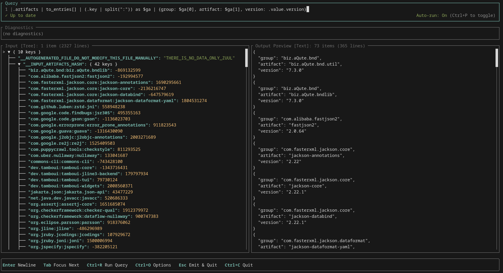

jackson-jq
==========

A pure-Java, embeddable [jq](http://stedolan.github.io/jq/) implementation with pluggable JSON providers.

[](https://github.com/eiiches/jackson-jq/actions)

> [!WARNING]
> You are viewing the development branch for jackson-jq 2.x. Stable releases are currently published from the [1.x branch](https://github.com/eiiches/jackson-jq/tree/develop/1.x).


Getting started
---------------

Java 17 or later is required.
If you use Maven, add `jackson-jq-core` and the appropriate JSON provider to the `<dependencies>` section of your POM. Add the regex implementation only if your application uses regex functions.

```xml
<dependency>
	<groupId>net.thisptr.jackson.jq.v2</groupId>
	<artifactId>jackson-jq-core</artifactId>
	<version>2.0.0-alpha2</version>
</dependency>

<!-- Optional: add this dependency if your application uses regex functions -->
<dependency>
	<groupId>net.thisptr.jackson.jq.v2</groupId>
	<artifactId>jackson-jq-regex-impl-joni</artifactId>
	<version>2.0.0-alpha2</version>
	<scope>runtime</scope>
</dependency>

<!-- Choose one JSON provider that matches the JSON library your application uses -->
<dependency>
	<groupId>net.thisptr.jackson.jq.v2</groupId>
	<artifactId>jackson-jq-json-provider-impl-jackson2</artifactId>
	<version>2.0.0-alpha2</version>
</dependency>
<dependency>
    <!-- Requires Java 17. -->
	<groupId>net.thisptr.jackson.jq.v2</groupId>
	<artifactId>jackson-jq-json-provider-impl-jackson3</artifactId>
	<version>2.0.0-alpha2</version>
</dependency>
<dependency>
	<groupId>net.thisptr.jackson.jq.v2</groupId>
	<artifactId>jackson-jq-json-provider-impl-gson</artifactId>
	<version>2.0.0-alpha2</version>
</dependency>
<dependency>
    <!-- Requires Java 11 and JSON-P 2.1 implementation such as `org.eclipse.parsson:parsson`. -->
	<groupId>net.thisptr.jackson.jq.v2</groupId>
	<artifactId>jackson-jq-json-provider-impl-jakarta</artifactId>
	<version>2.0.0-alpha2</version>
</dependency>
```


See the JUnit 5 test cases in the [examples](examples) directory for examples of using the API.

Command-line interface
----------------------

Use the jackson-jq CLI to test queries quickly.

*jackson-jq is primarily a Java library. The CLI is intended only for debugging and testing, not for production use. Its command-line options may change without notice.*

```sh
$ curl -LO https://repo1.maven.org/maven2/net/thisptr/jackson/jq/v2/jackson-jq-cli/2.0.0-alpha2/jackson-jq-cli-2.0.0-alpha2.jar

$ java -jar jackson-jq-cli-2.0.0-alpha2.jar --help
 usage:  jackson-jq [OPTIONS...] QUERY [FILE...]

        Options            Since                   Description
 -c, --compact              --       compact instead of pretty-printed output
 -r, --raw-output           --       output raw strings, not JSON texts
 -n, --null-input           --       use `null` as the single input value
 -R, --raw-input            --       read each line as string instead of JSON
 -s, --slurp                --       read all inputs into an array and use it
                                      as the single input value
 -f, --from-file <arg>      --       load the filter from a file
 --jq <arg>                 --       specify jq version
 --json-provider <arg>      --       JSON provider: jackson2, jackson3,
                                      fastjson2, gson, or jakarta (default:
                                      jackson3)
 -h, --help                 --       print this message

$ java -jar jackson-jq-cli-2.0.0-alpha2.jar '.foo'
{"foo": 42}
42
```

To test a query against a specific jq version, use the `--jq` option:

```sh
$ java -jar jackson-jq-cli-2.0.0-alpha2.jar --jq 1.5 'join("-")'
["1", 2]
jq: error: string ("-") and number (2) cannot be added

$ java -jar jackson-jq-cli-2.0.0-alpha2.jar --jq 1.6 'join("-")' # jq-1.6 can join any values, not only strings
["1", 2]
"1-2"
```

### Interactive mode

Pass `-i` / `--interactive` to open an interactive playground instead of evaluating the query once.
The query is re-evaluated as you type, so you can build up a filter while watching the output.

```sh
$ cat maven_install.json | java -jar jackson-jq-cli-2.0.0-alpha2.jar -i

$ curl -s https://api.github.com/repos/eiiches/jackson-jq | java -jar jackson-jq-cli-2.0.0-alpha2.jar -i '.name'
```

The query and any input files are optional; the query defaults to `.`, and `-n` starts the playground with `null` as the input.

Vim keybindings default to `--vim=auto`: interactive mode enables them when the executable named by `EDITOR` is `vi` or `vim`. Paths and editor arguments are accepted, such as `EDITOR=/usr/bin/vim` or `EDITOR="vim -f"`. Use `--vim` or `--vim=true` to force Vim keybindings and imply `--interactive`; use `--vim=false` to force standard editing. Press `Esc` to return to Normal mode and use `:q` to apply the query and exit.



The screen is split into a query editor, a diagnostics pane, and input and output previews. `Tab` (`Shift+Tab` for the reverse direction) moves the focus between them.

| Key | Action |
| --- | ------ |
| `Ctrl+R` | evaluate the query now |
| `Ctrl+P` | pause or resume automatic evaluation |
| `Ctrl+O` | open the options dialog |
| `Esc` | print the current output to stdout and quit |
| `Ctrl+C` | quit without output; the equivalent non-interactive command line is printed to stderr |

In the input and output previews, `↑`/`↓` (or `j`/`k`) move the cursor, `Ctrl+U`/`Ctrl+D` scroll by a page, `←`/`→` (or `h`/`l`) and `Space` collapse and expand nodes, `t` switches between the tree and text views, and `/` starts an incremental search (`n` and `N` jump between matches).

The options dialog changes `-R`, `-s`, `-c` and `-r`, the jq version, the JSON provider, and the runtime limits without leaving the playground. Changes apply immediately and are reflected in the command line printed on exit.

Documentation
-------------

* [Compatibility with jq](docs/compatibility.md)
* [Regex](docs/regex.md)
* [Extension modules](docs/modules/README.md)
* [Git branching and versioning](docs/development.md)

Contributing
------------

* If jackson-jq produces different results from jq, please [file an issue](https://github.com/eiiches/jackson-jq/issues). Such differences are treated as bugs in jackson-jq.
* Before submitting a nontrivial pull request, please open an issue to discuss the proposed change with the maintainers.
* Documentation improvements, including small grammar and wording corrections, are also welcome.

License
-------

This software is licensed under the Apache License, Version 2.0, with the following exceptions:

* [tests/test-cases](tests/test-cases) contains test cases from [stedolan/jq](https://github.com/stedolan/jq).
* [CoreJqLibrary.java](jackson-jq-core/src/main/java/net/thisptr/jackson/jq/v2/core/internal/builtins/library/CoreJqLibrary.java) and [RegexJqLibrary.java](jackson-jq-regex-impl-joni/src/main/java/net/thisptr/jackson/jq/v2/regex/impl/joni/RegexJqLibrary.java) contain function definitions extracted from [jqlang/jq](https://github.com/jqlang/jq).

See [LICENSE](LICENSE) for details.
